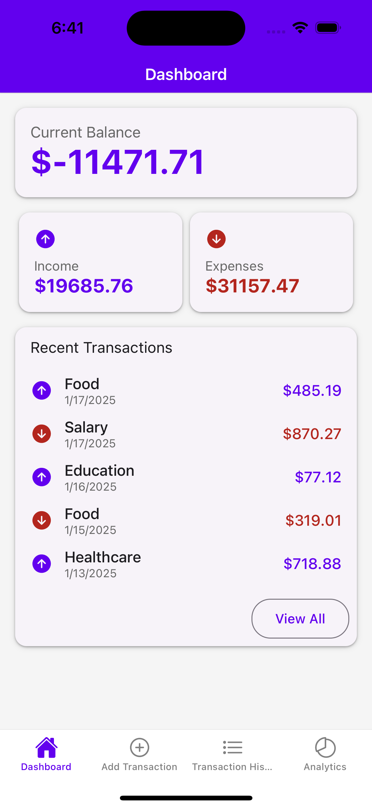
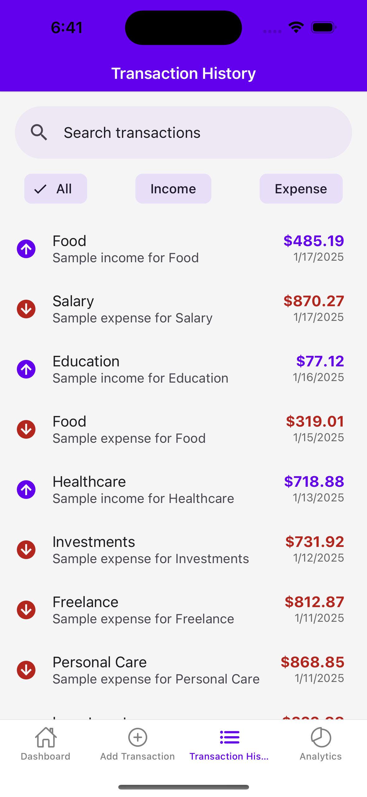
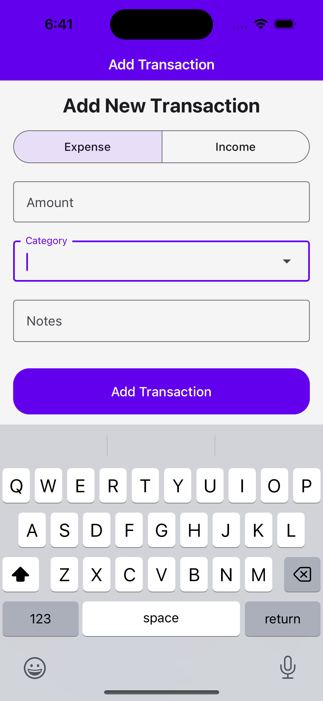
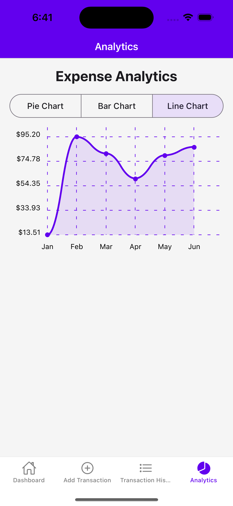

# Offline Expense Tracker

## Overview

The **Offline Expense Tracker** is a mobile application that enables users to track their income and expenses effortlessly, even without an internet connection. It provides comprehensive features like categorization, transaction history, charts, and offline data synchronization.

---

## Requirements

### Functional Requirements

- **Add Transactions**: Users can log income or expense transactions.
- **Categorize Transactions**: Organize transactions into categories (e.g., Food, Rent, Travel).
- **View Transaction History**: Display past transactions with detailed information.
- **Graphs and Charts**: Visualize financial trends using:
  - **Pie charts** for expense breakdown.
  - **Bar graphs** for income vs. expenses over time.
  - **Line charts** for tracking monthly expenses.
- **Search and Filter**: Search and filter transactions by date, category, or amount.
- **Offline Access**: All features available offline.
- **Data Sync**: Sync transactions with a remote server when online.
- **Notifications**: Alerts for successful or failed sync operations.

### Non-Functional Requirements

- **Performance**: Ensure quick access to local data, even for large datasets.
- **Data Security**: Encrypt sensitive data stored locally.
- **Scalability**: Support increasing numbers of transactions.
- **Cross-Platform**: Seamless operation on both iOS and Android.
- **User-Friendly Interface**: Simplified UI for adding, editing, and visualizing transactions.

## Screenshots

## Dashboard

## Transactions

## Add Transaction

## Analytics

